# CodexTokenBar

在 Windows 任务栏上以彩色圆环实时展示本地 Codex CLI 的周配额用量。A Windows 10/11 taskbar ring that shows your local Codex CLI rate-limit usage at a glance. CodexTokenBar 是一个独立、非官方的个人项目，与 OpenAI 无任何关联，也未获得其认可或支持。

## 📋 功能与边界

| 功能 | 说明 |
| --- | --- |
| 实时配额圆环 | 在主显示器任务栏托盘槽位显示剩余周配额的环形指示 |
| 本地读取 | 通过本地 `codex app-server` JSON-RPC 标准输入输出子进程获取配额数据 |
| 摘要面板 | 左键单击展开/收起摘要并触发刷新，展示各配额池信息 |
| 右键菜单 | 右键打开应用菜单，可退出或管理应用 |
| 本地持久化 | 仅将设置、最近快照与脱敏日志写入本机数据目录 |

明确不做的事情：不内置或分发 Codex CLI、不复制其凭据、不通过私人远程端点调用配额、不提供长期历史记录、不做预测、不发送通知、不支持账户切换、不展示五小时配额、不包含钱包、下单或远程遥测。项目只选择常规 `limitId=codex` 的 10080 分钟周窗口，其他周池仅出现在摘要面板中。

## 🖥️ 运行要求

| 要求 | 说明 |
| --- | --- |
| 操作系统 | Windows 10/11 x64 |
| Codex CLI | 需要已安装并完成登录的本地 `codex` 可执行程序 |
| .NET 运行时 | 自包含 Release 版本不要求安装 .NET 运行时 |
| .NET SDK | 自行构建源码时需要 .NET 8 SDK |

## 📦 安装

1. 从 Release 页面下载 `CodexTokenBar-v1.0.0-win-x64.exe` 与 `SHA256SUMS.txt` 两个资产文件[^large-files][^releases]。
2. 在下载目录打开 PowerShell，运行 `Get-FileHash .\CodexTokenBar-v1.0.0-win-x64.exe -Algorithm SHA256`，将输出的 `Hash` 与 `SHA256SUMS.txt` 中该 EXE 对应行的 SHA-256 值逐字对照[^get-filehash]。
3. 校验一致后运行 `CodexTokenBar-v1.0.0-win-x64.exe`。应用会启动本机 `codex app-server` 子进程读取配额。
4. 圆环出现在主显示器任务栏托盘槽位（隐藏图标箭头左侧 64 DIP 处）。
5. 通过右键菜单退出应用；关闭窗口并不会退出应用。

## 🎨 圆环含义

圆环固定从 12 点钟方向开始，顺时针灰弧表示已消耗的配额，用阈值色弧表示剩余配额，中央文本是剩余配额的整数百分比。

- 剩余 >30%：绿色
- 剩余 10% 至 30%：黄色
- 剩余 <10%：红色
- 数据过期或不可信：灰色并显示长破折号

交互方式：左键单击展开或收起摘要面板并请求刷新；右键单击打开应用菜单；双击不会触发重复的单次点击动作。若任务栏锚定不可用，悬浮覆盖层会隐藏，并恢复标准的系统通知图标。

## 🔄 架构与数据流

```mermaid
flowchart LR
    accTitle: CodexTokenBar 配额数据流
    accDescr: 应用启动本地 codex app-server 子进程，通过 JSON-RPC 读取配额，在任务栏渲染圆环。
    codex_cli["本地 codex CLI 已认证"]
    app_server["codex app-server JSON-RPC stdio 子进程"]
    usage_monitor["UsageMonitor 周期读取"]
    quota_selector["QuotaSelector 选取 codex 周池"]
    rate_limit_reader["CodexRateLimitReader 读取并解析额度池"]
    taskbar_anchor["TaskbarAnchor 任务栏锚定"]
    ring_renderer["TaskbarRingRenderer 圆环渲染"]
    overlay_window["TaskbarQuotaWindow 悬浮窗口"]
    tray_icon["TrayIconController 通知图标"]
    snapshot_store["AppStateStore 本地快照"]

    codex_cli -->|启动| app_server
    usage_monitor -->|调用 ReadAsync| rate_limit_reader
    rate_limit_reader -->|JSON-RPC stdio| app_server
    app_server -->|返回额度池| rate_limit_reader
    rate_limit_reader -->|RateLimitSnapshot| usage_monitor
    usage_monitor -->|交给选择器| quota_selector
    quota_selector -->|返回 codex 周额度| usage_monitor
    usage_monitor --> snapshot_store
    usage_monitor --> taskbar_anchor
    taskbar_anchor --> overlay_window
    overlay_window --> ring_renderer
    tray_icon -->|请求刷新| usage_monitor

    classDef process fill:#dbeafe,stroke:#2563eb,stroke-width:2px,color:#1e3a5f
    classDef output fill:#dcfce7,stroke:#16a34a,stroke-width:2px,color:#14532d
    classDef storage fill:#fef9c3,stroke:#ca8a04,stroke-width:2px,color:#713f12
    class codex_cli,app_server,usage_monitor,quota_selector,rate_limit_reader process
    class taskbar_anchor,overlay_window,tray_icon,ring_renderer output
    class snapshot_store storage
```

## 🔒 隐私与安全边界

本应用只连接本机 `codex app-server` JSON-RPC 子进程，不直接连接远程配额端点。它不收集使用数据、不发送应用遥测，也不读取或复制你的 Codex CLI 凭据。这个边界只描述 CodexTokenBar；Codex CLI 为完成认证和自身功能，可能按其设计与 OpenAI 服务通信。

本地数据根目录为 `%LocalAppData%\CodexTokenBar`，包含以下文件：

| 文件 | 用途 |
| --- | --- |
| `settings.json` | 应用设置 |
| `snapshot.json` | 最近一次成功的配额快照 |
| `app.log` | 当前脱敏日志，最多 1 MB |
| `app.1.log` 至 `app.6.log` | 与 `app.log` 同目录的滚动日志；连同当前日志最多七个，每个最多 1 MB |

请勿向任何查询中粘贴原始配额载荷、凭据或未脱敏的日志内容。详见[安全策略](SECURITY.md)（`SECURITY.md`）。

## 🛠️ 从源码构建

1. 安装 .NET 8 SDK[^dotnet-download]。
2. 打开 PowerShell 并切换到仓库根目录。
3. 运行 [构建脚本](scripts/build.ps1)（`.\scripts\build.ps1`）。

期望的证据：测试 `126/126` 通过，Debug 和 Release 均为 0 警告、0 错误，并生成一个 Windows x64 自包含单文件 EXE。

也可以手动执行 `dotnet build`[^dotnet-build]，然后运行测试命令。

## 🔍 故障排查

| 问题 | 可能原因与处理 |
| --- | --- |
| 圆环没有出现 | 任务栏锚定不可用；覆盖层会自动隐藏并改用标准的系统通知图标 |
| 圆环显示灰色和长破折号 | 配额数据过期或不可信；左键单击触发刷新以获取最新数据 |
| 提示 `codex` 未找到 | 未安装 Codex CLI，或未将其加入 PATH；请先安装并配置[^codex-cli] |
| 提示未登录 | Codex CLI 未完成认证；完成登录后重试 |
| Explorer 或第三方任务栏不兼容 | 任务栏锚定依赖系统行为；不支持或失效时回退到通知图标 |
| 未签名应用警告 | EXE 目前未签名，Windows 可能显示来源或信誉警告。先确认下载来源并完成 SHA-256 对照；若无法确认文件可信，请停止运行，不要绕过系统安全检查 |

## ⚠️ 已知限制

- 当前实测证据仅覆盖 Windows 11 x64 双显示器环境，不要将结果简单推广到 Windows 10、第三方任务栏、所有 DPI 组合或未来的 Windows 版本。
- EXE 尚未签名，可能出现来源或信誉警告。
- 没有长期配额历史、预测或通知功能。

## 🤝 参与贡献

欢迎阅读[贡献指南](CONTRIBUTING.md)（`CONTRIBUTING.md`），了解如何设置开发环境、运行测试和提交代码。

## 🛡️ 安全

发现安全问题时请遵循[安全策略](SECURITY.md)（`SECURITY.md`）中的流程提交，不要在公开渠道张贴凭据、原始配额载荷或未脱敏日志。

## 📝 更新日志

版本变化见[更新日志](CHANGELOG.md)（`CHANGELOG.md`）。

## ⚖️ 许可证

本项目使用 MIT 许可证发布，详见[许可证](LICENSE)（`LICENSE`）。

[^large-files]: [GitHub 大型文件](https://docs.github.com/en/repositories/working-with-files/managing-large-files/about-large-files-on-github)
[^releases]: [GitHub Releases 关于](https://docs.github.com/en/repositories/releasing-projects-on-github/about-releases)
[^get-filehash]: [PowerShell Get-FileHash](https://learn.microsoft.com/en-us/powershell/module/microsoft.powershell.utility/get-filehash)
[^dotnet-download]: [.NET 8 下载](https://dotnet.microsoft.com/en-us/download/dotnet/8.0)
[^dotnet-build]: [.NET build CLI](https://learn.microsoft.com/en-us/dotnet/core/tools/dotnet-build)
[^codex-cli]: [OpenAI Codex CLI](https://developers.openai.com/codex/cli)
